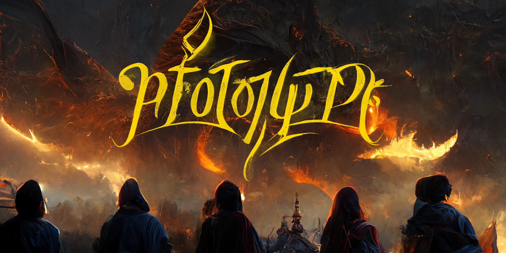

---
# prototype

Prototype is a one-shot TTRPG ruleset for those who want to get a session going with very little time on their hands because somehow the stars aligned at the last minute and everyone would be up for a game tomorrow. But if you want to use this rulebook for a full-fledged campaign, no one will be able stop you, you lunatic.

## base game
The overall promise is a simple, fast and fun session with a dash of randomness as the DM only gives a rough direction and otherwise lets the dice do the talking. Your characters will develop freely over time without set rules of what can or cannot be done, your imagination is the limit.

If this has sparked your interest, then check out the entire [ruleset of prototype](./base/00_rules.md).

## extensions
As this ruleset is rather new, there is not too much content regarding creatures and monsters, additional classes, races or weapons. These will tickle in down the line. Heck maybe there will be even a futuristic setting?!

If you wanna check out additional content, visit the [extensions of prototype](./extensions)

## testing grounds
To roughly determine the balance of rules and stats, some Jupyter notebooks were made to simulate dice results and simplified battles. More complex analyses will follow.

For more information visit the [testing grounds](./testing_grounds).

## prototype toolset
For more information visit the [prototype toolset](./prototype_toolset/index.html).