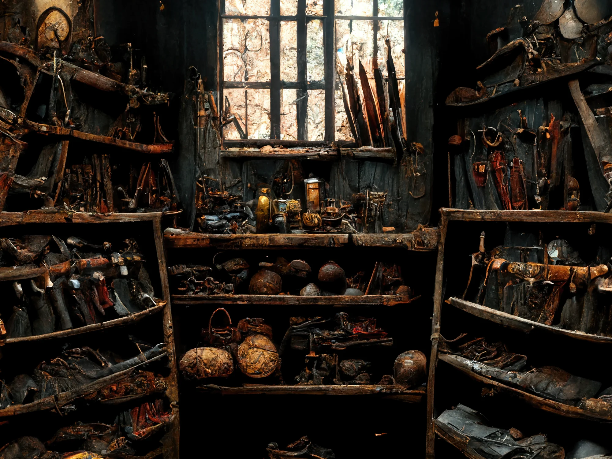

# the armour, wands, weapons and tools of prototype

Armour, wands, weapons and tools can be used by player to give them a advantage on skill checks and in combat.
Every item has has one or multiple modifiers, called bonuses. These are rolled by the GM with a 1d100 and apply to the found item.

## armour

| armour     | movement | defense | stealth | bonus slots |
| ---------- |:--------:|:-------:|:-------:|:-----------:|
| cloth      | +1 block | -5      | +10     | 2           |
| leather    | +1 block | 0       | +5      | 1           |
| chain mail | 0        | +5      | 0       | 1           |
| scale      | -1 block | +5      | -5      | 2           |
| plate      | -1 block | +10     | -10     | 3           |

### bonus of armour

| probability | effect     | roll | damage (on fail) | heal (on success) | actions | spell slots |
|:-----------:|:----------:|:----:|:----------------:|:-----------------:|:-------:|:-----------:|
| 1-4         | bridle     | -10  | 5                | -                 | -1      | -           |
| 5-14        | unlucky    | -5   | -                | -                 | -       | -           |
| 15-29       | rusty      | -5   | -                | -                 | -       | -           |
| 30-69       | normal     | -    | -                | -                 | -       | -           |
| 70-79       | hardened   | +5   | -                | -                 | -       | -           |
| 80-89       | reinforced | +10  | -                | -                 | -       | -           |
| 90-94       | charmed    | -    | -                | -                 | -       | +1          |
| 95-99       | demonic    | -    | 5                | 10                | -       | -           |
| 100         | angelic    | -    | -                | 5                 | +1      | +1          |

## weapons

### types of weapons

#### close range

| weapon     | action | damage | range | handed | bonus slots |
|:----------:|:------:|:------:|:-----:|:------:|:-----------:|
| axe        | 1      | 2d10   | 1     | 1      | 1           |
| claymore   | 2      | 3d10   | 2     | 2      | 1           |
| daneaxe    | 2      | 3d10   | 2     | 2      | 1           |
| dagger     | 1      | 1d10   | 1     | 1      | 1           |
| flail      | 2      | 2d10   | 2     | 1      | 1           |
| mace       | 1      | 2d10   | 1     | 1      | 2           |
| shield     | 1      | 1d10   | 1     | 1      | 1           |
| sword      | 1      | 2d10   | 1     | 1      | 1           |
| war hammer | 2      | 3d10   | 1     | 1      | 1           |

#### medium range

| weapon  | action | damage | range | handed | bonus slots |
|:-------:|:------:|:------:|:-----:|:------:|:-----------:|
| halberd | 2      | 3d10   | 3     | 2      | 1           |
| pike    | 1      | 1d10   | 4     | 2      | 2           |
| voulge  | 2      | 3d10   | 3     | 2      | 2           |

#### long range

| weapon       | action | damage | range | handed | bonus slots |
|:------------:|:------:|:------:|:-----:|:------:|:-----------:|
| arabalest    | 2      | 4d10   | 12    | 2      | 2           |
| short bow    | 1      | 1d10   | 8     | 2      | 1           |
| crossbow     | 2      | 3d10   | 10    | 2      | 1           |
| long bow     | 1      | 2d10   | 10    | 2      | 2           |
| javelin      | 1      | 2d10   | 6\|2  | 1      | 1           |
| sling        | 1      | 1d10   | 8     | 1      | 1           |
| throwing axe | 1      | 2d10   | 6\|1  | 1      | 1           |

#### wands

| weapon         | magic damage | spell range | handed | bonus slots |
|:--------------:|:------------:|:-----------:|:------:|:-----------:|
| hands          | 1d10         | 4           | 1      | -           |
| amber staff    | 2d10         | 6           | 1      | 1           |
| opal staff     | 2d10         | 8           | 1      | 2           |
| sapphire staff | 3d10         | 8           | 1      | 1           |
| obsidian staff | 3d10         | 10          | 1      | 2           |
| ruby staff     | 4d10         | 12          | 2      | 3           |

### bonus of wands and weapons

| probability | effect    | damage/magic damage | range | self-damage | action use | life steal (on success) |
|:-----------:|:---------:|:-------------------:|:-----:|:-----------:|:----------:|:-----------------------:|
| 1-4         | broken    | -10                 | -1    | -           | -          | -                       |
| 5-9         | damaged   | -5                  | -     | 5           | -          | -                       |
| 10-14       | dull      | -5                  | -     | -           | -          | -                       |
| 15-19       | unlucky   | -                   | -     | 5           | -          | +5                      |
| 20-24       | bulky     | -                   | +1    | -           | +1         | -                       |
| 25-29       | annoying  | -                   | +1    | -           | -          | -                       |
| 30-34       | short     | -                   | -1    | -           | -          | -                       |
| 35-64       | normal    | -                   | -     | -           | -          | -                       |
| 65-69       | long      | -                   | +1    | -           | -          | -                       |
| 70-74       | light     | -                   | -     | -           | -1         | -                       |
| 75-79       | ruthless  | +10                 | -     | 5           | -          | -                       |
| 80-84       | heavy     | +5                  | -     | -           | +1         | -                       |
| 85-89       | demonic   | +5                  | -     | 5           | -          | +10                     |
| 90-94       | mythical  | +5                  | +1    | -           | -1         | -                       |
| 95-100      | celestial | +15                 | -     | -           | -          | +10                     |

## tools

Tools can range from lock pick to a pickaxe.

| probability | effect | roll |
|:-----------:|:------:|:----:|
| 0-69        | normal | +5   |
| 70-94       | quick  | +10  |
| 95-99       | hard   | +15  |
| 100         | lucky  | +20  |
