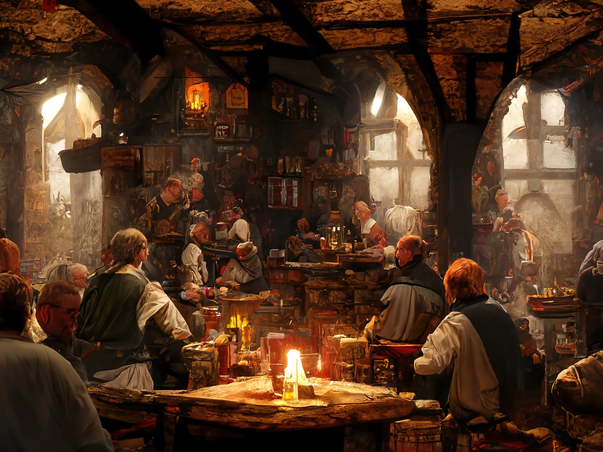

# the classes and races of prototype

## races

| races    | story                                                                                                                                                                                                                                                                                         | trait                                                                                                                 | combat                                                                                                | magic                                                                                                  |
|:--------:|:--------------------------------------------------------------------------------------------------------------------------------------------------------------------------------------------------------------------------------------------------------------------------------------------- | --------------------------------------------------------------------------------------------------------------------- | ----------------------------------------------------------------------------------------------------- | ------------------------------------------------------------------------------------------------------ |
| dwarf    | Dwarves normally live at higher altitudes and inhabit hills and mountains. The dwarf cities built there are very old and have a long history to tell. However, dwarves sometimes also live underground, but the halls built there were usually not built by dwarven hands, but by gnomes.     | **sturdy** - add 25 to base health                                                                                    | **tough** - +5 on defensive throws   **slow** - has only 2 action (no additional movement action) | **capable** - 2 mana points  **ignorant** - learn 1 spell                                          |
| elf      | Elves are mystical beings, they live in the great forests and form small realms. They are less sociable, as their people tend to live in isolation from the rest of the world. Of all races, elves get along best with halflings, as they are also nature-loving and peaceful.                | **slender** - minus 25 on base health  **dark vision** - can see in gloominess                                    | **agile** - can move 3 fields per action                                                              | **magical** - 3 mana points  **knowing** - learn 2 spells                                          |
| gnome    | Great underground halls are their home, and although the dwarves claim this reputation in the upper world, the gnomes are the true builders of the underworld. They like to live among themselves. However, they are usually found in dwarven cities, as both have a penchant for technology. | **slender** - subtract 25 from base health  **dark vision** - can see in gloominess                               |                                                                                                       | **magical** - 3 spell slots  **intuitive** - learn 3 spells  **mystical** - learn 1 ritual     |
| halfling | Halflings are the small, cosy elves of the meadows. Unlike their distant relatives from the forests they like to live with pretty much everyone. When they do live among themselves, it is usually in small villages without much crowding on the streets.                                    | **squishy** - subtract 50 from base health  **lucky** - can re-roll 1d10 with a value of 1 (only once per action) |                                                                                                       | **truly magical** - 4 mana points  **intuitive** - learn 3 spells                                  |
| human    | Humans are the most widespread race and have large kingdoms. They are very social and mostly live in communities with other people. This is possible mainly because they are relatively generic. They can do everything a little bit, but nothing really skilfully.                           | **jack of all trades** - add 2 to every out-of-combat skill check                                                     | **prodigy** - has full 3 actions (no additional movement action)                                      | **capable** - 2 mana points  **ignorant** - learn 1 spells                                         |
| orc      | Orcs live in tribes and are usually wary of uninvited guests. However, once you have gained their trust, they are extremely cordial and have their hearts in the right place. Outwardly, they act tough and gruff so as not to be perceived as a wimp.                                        | **glutton** - needs ration to rest, half healing from resting                                                         | **rage** - can use the same action/attack level twice per turn                                        | **modest** - 1 mana point   **ignorant** - learn 1 spell  **truly mystical** - learn 2 rituals |

## classes

| class     | story                                                                        | traits                                                                                                                     | combat                                                                                                                                                                                                                                                        | magic                                                                                                         |
|:---------:| ---------------------------------------------------------------------------- | -------------------------------------------------------------------------------------------------------------------------- | ------------------------------------------------------------------------------------------------------------------------------------------------------------------------------------------------------------------------------------------------------------- | ------------------------------------------------------------------------------------------------------------- |
| arcanist  | They are extremely powerful and unpredictable in their arts.                 | **slender** - minus 1d10 on base health                                                                                    | **weak** - weapons use 1 action more (at most 2 actions)                                                                                                                                                                                                      | **offensive** - no supportive spells  **magical** - add 3 mana points  **intuitive** - learn 3 spells |
| minstrel  | They are the backbone of a group and make them give their best.              | **curing** - heal spell does +1d10 healing                                                                                 |                                                                                                                                                                                                                                                               | **supportive** - no offensive spells  **magical** - add 3 mana points  **knowing** - learn 2 spells   |
| scoundrel | They go into the shadows and are up for all kinds of shenanigans.            | **jack of all trades** - add 2 to every out-of-combat skill check  **slender** - minus 1d10 on base health             | **sneaky** - inflicts double the damage with daggers while stealthed  **quick** - can attack twice with dagger, slings and short bows per action                                                                                                          | **modest** - only utility spells  **ignorant** - add 1 mana point  **modest** - learn 1 spell         |
| sentinel  | They watch over their flocks and leave no one behind.                        | **tough** - add 1d10 to base health  **first aid** - treating wounds does Xd10 healing (X is the level for this skill) | **first aid** - treating wounds does true healing  **shielded** - can use a shield +1d10 on next defend roll (costs one action to prepare)                                                                                                                | **supportive** - no offensive spells  **modest** - learn 1 spell                                          |
| warseeker | They are spiritual, fierce fighters with whom it is better not to mess with. |                                                                                                                            | **strong** - weapons use 1 action less (at least 1 action)  **dual wielding** - can attack with two one-handed weapons at once as one action (half the damage of the second attack)  **prodigy** - has full 3 actions (no additional movement action) | **ritual** - only utility spells and rituals  **mystical** - learn 1 ritual                               |
